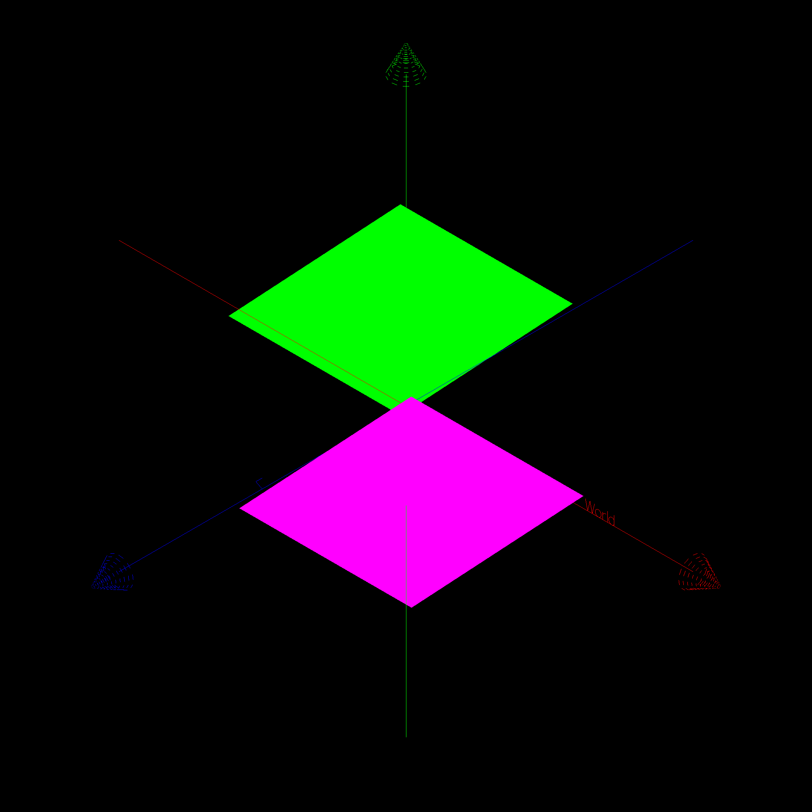
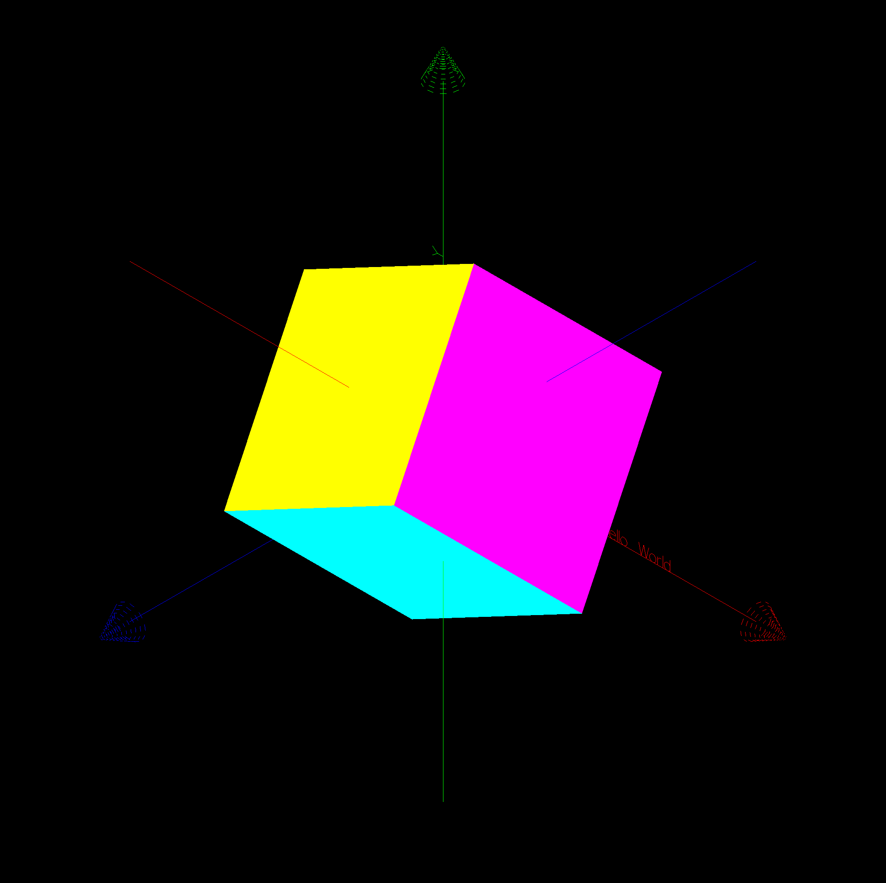

### Haskell OpenGL, draw cube with QUADS





* Vertex GLfloat

* Top Face

```
    ls_top =   [p0, p1, p2, p3]
```

* Bottom Face

```
    ls_bot =   [q0, q1, q2, q3]
```

```
   -- top face

    ls_top =   [p0, p1, p2, p3]

   -- bottom face

    b = 0.3 :: GLfloat
    p0 = Vertex3 b    b    (-b)
    p1 = Vertex3 (-b) b    (-b)   
    p2 = Vertex3 (-b) b    b
    p3 = Vertex3 b    b    b
  
    q0 = Vertex3 b    (-b) (-b)
    q1 = Vertex3 (-b) (-b) (-b) 
    q2 = Vertex3 (-b) (-b) b
    q3 = Vertex3 b    (-b) b
    
    ls_top =   [p0, p1, p2, p3]
    ls_bot =   [q0, q1, q2, q3]

    ls_front = [p3, p2, q2, q3]
    ls_back =  [p0, p1, q1, q0]
    ls_left =  [p1, p2, q2, q1]
    ls_right = [p0, p3, q3, q0]

drawCube :: IO ()
drawCube = do
  preservingMatrix $ do
    renderPrimitive Quads $
      mapM_
        ( \v -> do
            color green
            vertex v
        )
        ls_top
    renderPrimitive Quads $
      mapM_
        ( \v -> do
            color magenta
            vertex v
        )
        ls_bot
    renderPrimitive Quads $
      mapM_
        ( \v -> do
            color cyan
            vertex v
        )
        ls_front
  
    renderPrimitive Quads $
      mapM_
        ( \v -> do
            color blue
            vertex v
        )
        ls_back
  
    renderPrimitive Quads $
      mapM_
        ( \v -> do
            color yellow
            vertex v
        )
        ls_left
 
    renderPrimitive Quads $
      mapM_
        ( \v -> do
            color gray
            vertex v
        )
        ls_right
  
	
```
